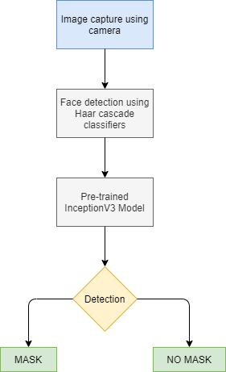

# Face Mask Detector
Detect if a person is wearing a face mask or not real-time, using camera.

## Run
Open and run file Live feed.ipynb

## Required libraries
- tensorflow>2.0
- scikit-learn
- OpenCV
- nbformat
- pillow

## Dataset directory paths
### TRAIN SET
env\dataset\training_set\mask  
env\dataset\training_set\no_mask
### TEST SET
env\dataset\test_set\mask  
env\dataset\test_set\no_mask

## Dataset
The dataset can be sourced from the following links:  
https://www.kaggle.com/andrewmvd/face-mask-detection  
https://drive.google.com/drive/folders/1taHKxS66YKJNhdhiGcEdM6nnE5W9zBb1
